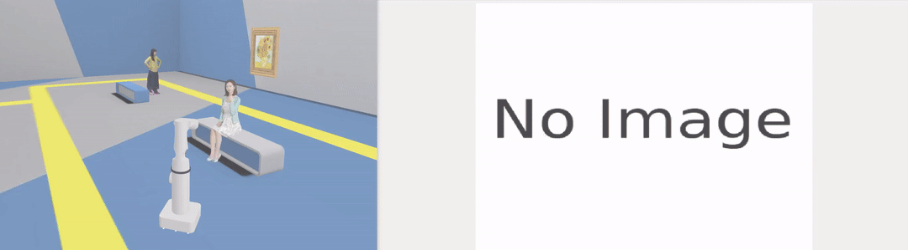

# Human-Pose-Estimation-using-YOLOv8-and-ROS2

## Overview

This code can identify human limbs and calculate the angles between them, for instance, the angle created when you bend your elbow.

This GIF visualises the work done by this repository:




## Useful Links

1. YOLO (You Only Look Once). (https://docs.ultralytics.com/)
2. Rviz2. (https://docs.ros.org/en/rolling/p/rviz2/)

## How it works

This project makes use of the DeepMind robot.

To launch the robot in a simulation environment run the following:

```
cd src/deepmind_bot/scripts
./start_deepmindbot_perception1.sh
```
For the real-time object detection aspect of the project, YOLOv8 ([see link](#useful-links)) has been utilised.

The `src/advanced_perception` package handles the Pose Estimation.

The specific YOLOv8 model employed in this project is `yolov8n-pose.pt` and is stored in `src/advanced_perception/data`.

### Launching and Testing 

Launch Rviz2 by executing:
```
rviz2 -d ~/src/yolo_pose_estimation.rviz
```
Ensure that in RViz2, the topic `/pose_estimation/result` has been used for the `Image` display.

To run the pipeline execute:

```
ros2 run advanced_perception yolo_pose_estimation_node
```

To move the robot around execute:
```
ros2 run teleop_twist_keyboard teleop_twist_keyboard
```

The `yolov8_pose_results` topic contains the estimated poses hence to view them in real-time, execute:
```
ros2 topic echo /yolov8_pose_results
```


### Credits

Credits to The Construct for providing a platform to do this.
